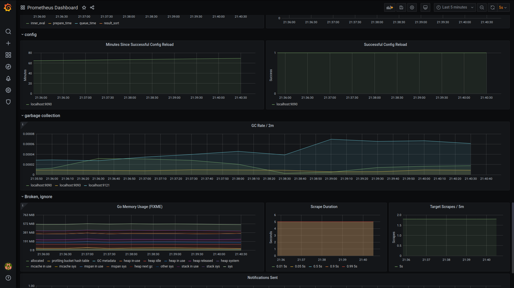
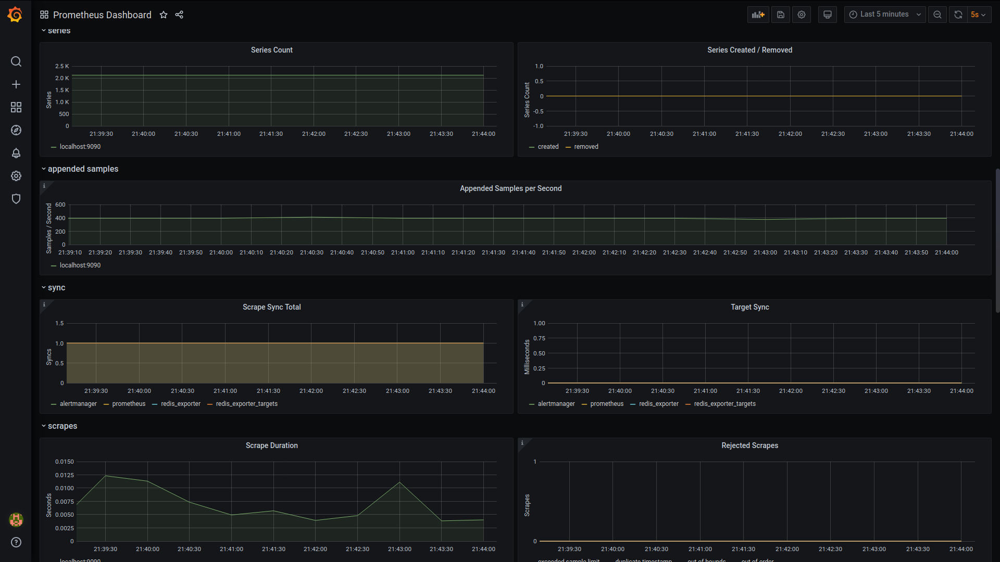

# Monitoring Redis Cluster Grafana

Hi, I have a redis cluster running on my system. I also have an application that is talking to the redis
cluster and sending out commands to the cluster i.e it is setting and getting keys. Now that’s all fine
until I find that some of the keys are not being set properly due to some error or that my application
is not working in the manner I intended it to do or the redis cluster itself has gone down or the CPU usage is too high. There can be many issues when the application is running (some very
uncommon issues may also come up) in a production environment. Therefore, it is highly necessary and important that I monitor the performance of my entire system.\
How do I do that? Using Grafana, Prometheus and redis exporter. Using these three applications, I have tried to make a monitoring system that monitors the performance of the redis cluster with 3 masters and 3 slaves. The monitoring system also sends out alerts on flock channel whenever any critical issue is detected that needs immediate attention.\
\
I like to use docker containers and hence I have used docker containers for this project.

## Project description

Description:\
A *python application* (pyredis.py) that talks to the redis cluster and randomly sets, gets or expire
random keys.\
\
*Prometheus* that scrapes the redis cluster within fixed intervals of 5s and evaluates the metrics
against a set of rules in order to decide whether an alert needs to be generated or not\
\
*Alertmanager* – alertmanager monitors the generated alert by prometheus, gets the generated alert,
groups them by the alert name and its serverity (warning/critical) and accordingly sends out alert to
the flock channel depending on group wait time and other timeouts.\
\
*Redis_exporter* is a exporter for prometheus that provides the necessary metrics that can be viewed
in a grafana dashboard.\
\
*Grafana* is a visualization software that helps us to easily visualize metrics so as to ease our
decision making capabilites and monitor the redis cluster, CPU usage and even Prometheus.

## Grafana Dashboard
\
\
\
\
\
\
\
\
\

## Prometheus Dashboard

## How to start the script?
Starting the monitor is easy. Just need to run three commands.
Pre-requisites: docker, python3, pip3 and internet connection
There are three important files in the (well all are important files but mainly three to start
monitoring) provided folder.
1. start_monitor.sh
2. grafana/dashboard/redis.json
3. grafana/dashboard/prometheus.json

## *Steps:*
1. open terminal in the folder, run `bash start_monitor.sh`
This will start the redis cluster on 9100 – 9105 ports.
2. Type yes if prompted on the terminal
3. After the redis cluster is started, script automatically starts the docker containers from a docker-
compose file.
4. If successfully started, go to browser and hit localhost:3000
You might need to login with username = admin and password = admin.
The datasources should automatically be installed in the grafana. If not, you can mannualy import
the datascources from grafana/datasources/Prometheus.json
5. Import the dashboards in grafana from grafana/dashboard/redis.json and
grafana/dashboard/prometheus.json
6. Open a new terminal and run `pip3 install redis redis-py-cluster`
7. Then run `python3 pyredis.py`

## Alert rules 
*defined in rules.yml, all alert rules for 15s*
1. InstanceDown: when any instance is down
2. RedisDown
3. TooManyCommands: When the number of commands executed per second is too high
4. ProcessNearFDLimits: When process file descriptors
5. HighCPUUsage: When CPU Usage is high

*defined via Grafana Alert rules*
1. Storage Memory Chunks alert: When rate of storage memory usage goes very very high in an
instant
All the alerts are sent to a private flock channel.

## Some important variable values
1. Scrape interval: 5s, Prometheus uses this to scrape metrics from redis exporter
2. Evaluate Interval: 45s, Interval used by prometheus to evaluate the alert rules after each
evaluate_interval.

## Important Metrics Monitored
1. max(max_over_time(redis_uptime_in_seconds[$__interval]))
2. 100 * sum(redis_memory_used_bytes) / sum(redis_memory_max_bytes )
3. rate(redis_commands_processed_total[1m])
4. irate(redis_keyspace_hits_total[5m])
5. irate(redis_keyspace_misses_total[5m])
6. up
7. sum (redis_db_keys)
8. non expiring keys: sum (redis_db_keys) - sum (redis_db_keys_expiring)
9. expiring keys: sum (redis_db_keys_expiring)
10. cpu usage redis: rate(redis_cpu_sys_seconds_total[1m])
11. CPU usage by system in seconds
12. sum (redis_cluster_slots_fail)
13. redis_memory_used_bytes
14. redis_memory_max_bytes, etc

So this is how I tried to monitor my redis cluster with 3 master and 3 slaves. I wanted to be able to
run the entire system with a single script and that is why I wrote the start_monitor.sh
I even tried to install the dashboards in grafana by a sh script so that I don’t have to manually
import the dashboards in grafana but I was facing errors. It installs the datasource but not unable to
install the dashboard. Therefore, I disabled that part of the script that installs the dashboard and then
manually install them.
Please do give feedback or create github issue if anything can be improved, automated or monitored in a better way.

